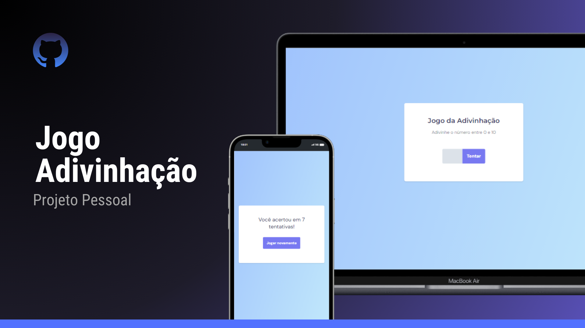

<h1 align="center"> Jogo Adivinhação </h1>

  <a href="#-tecnologias">Tecnologias</a>&nbsp;&nbsp;&nbsp;|&nbsp;&nbsp;&nbsp;
  <a href="#-projeto">Projeto</a>&nbsp;&nbsp;&nbsp;|&nbsp;&nbsp;&nbsp;
  <a href="#-layout">Layout</a>&nbsp;&nbsp;&nbsp;|&nbsp;&nbsp;&nbsp;
  <a href="#memo-licença">Licença</a>

  

 

  

## 🚀 Tecnologias

Esse projeto foi desenvolvido com as seguintes tecnologias:

- HTML e CSS
- JavaScript
- Git e Github
- Figma

## 💻 Projeto

O projeto "Jogo Adivinhação" é um site onde você pode se divertir tentando adivinhar o número em que a máquinas está pensando e no final ele imprime em quantas tentativas você acertou.

- [Acesse o projeto finalizado (online).](https://silverioesantos.github.io/jogo-adivinhacao/)

## 🔖 Layout

Você pode visualizar o layout do projeto através [DESSE LINK](https://www.figma.com/file/toVrW82deNH8L4V7NpVRHB/Jogo-Adivinha%C3%A7%C3%A3o?type=design&t=4wBw01UmRfjPg1ha-6). É necessário ter conta no [Figma](https://figma.com) para acessá-lo.

## :memo: Licença

Esse projeto está sob a licença MIT.
